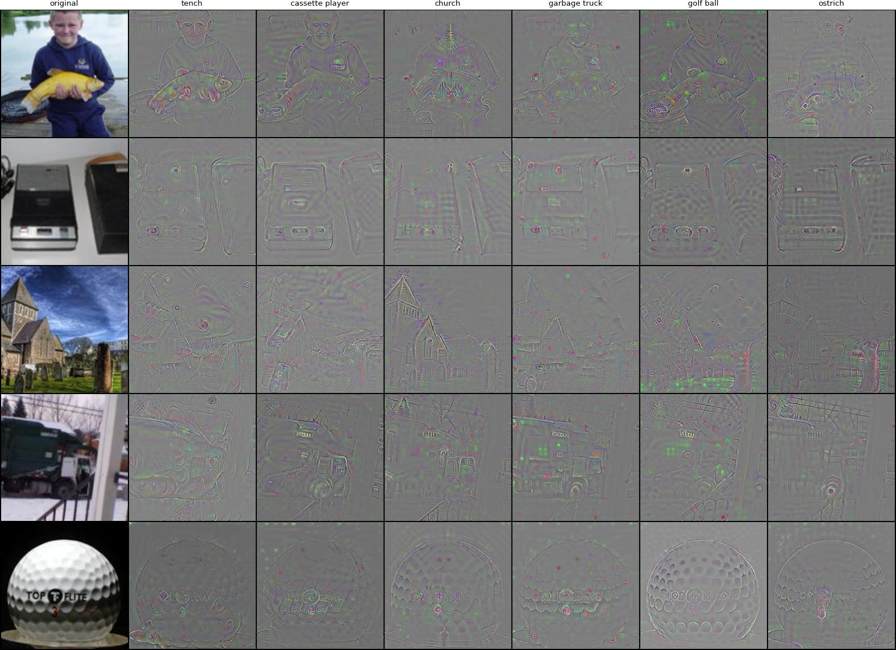
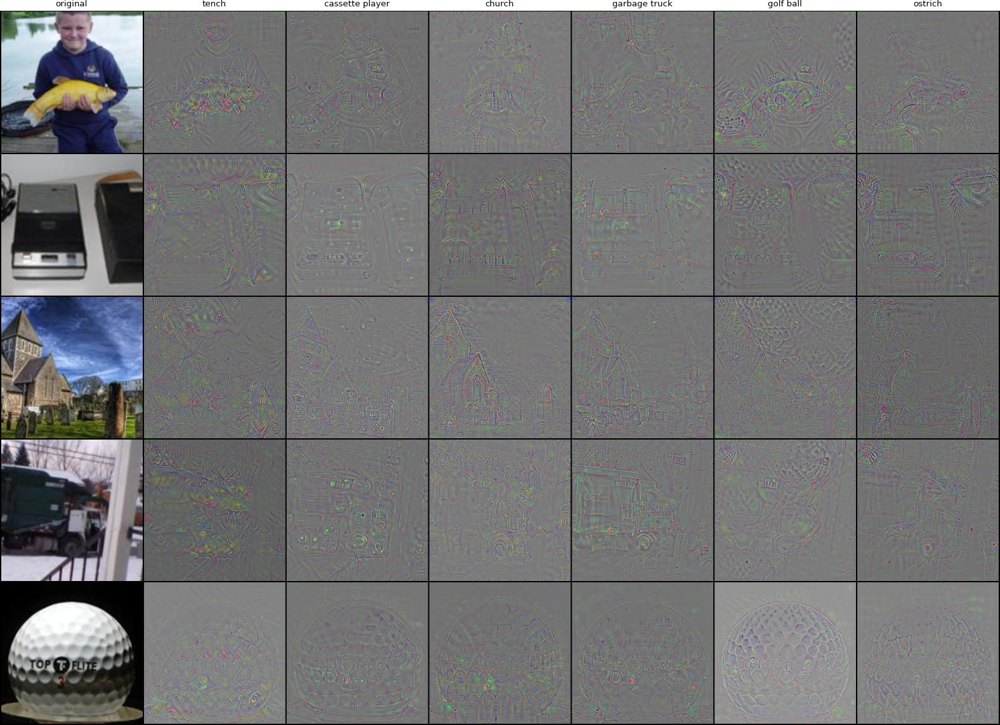
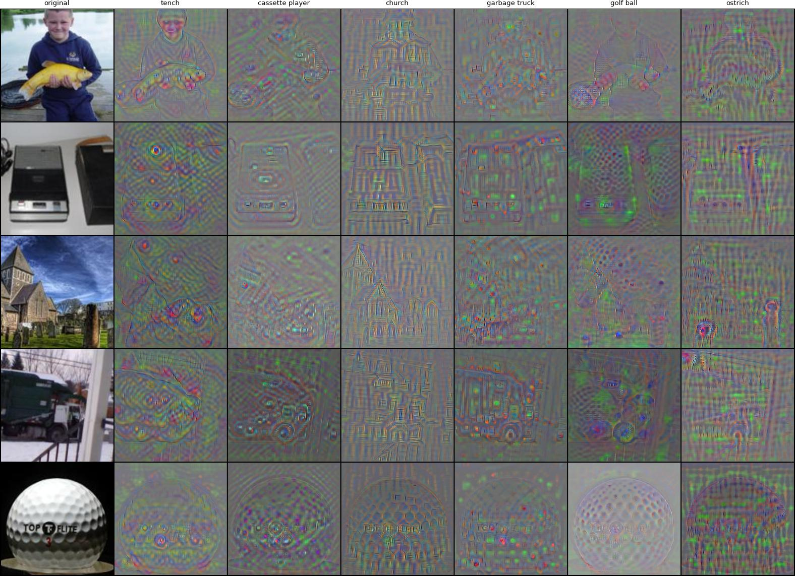
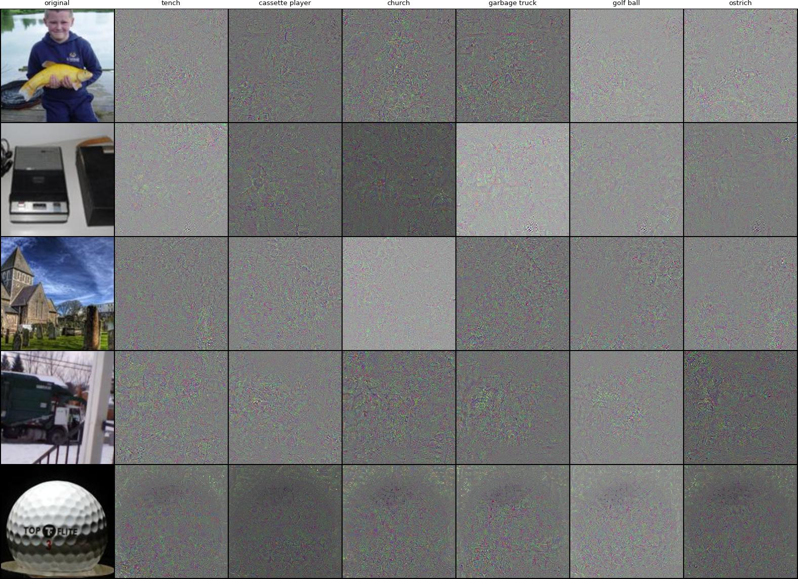
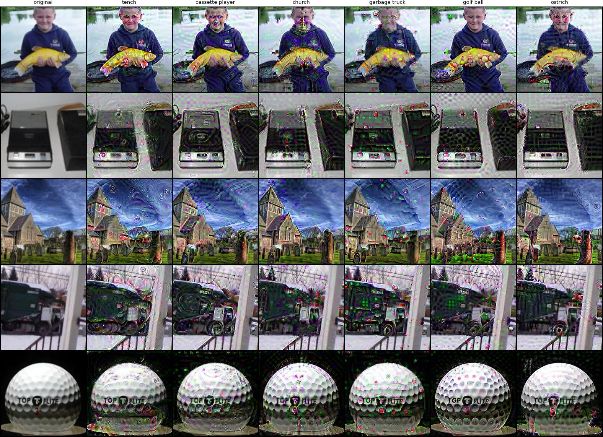
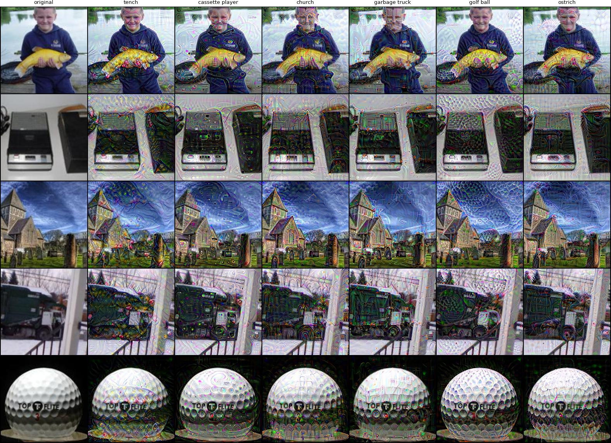
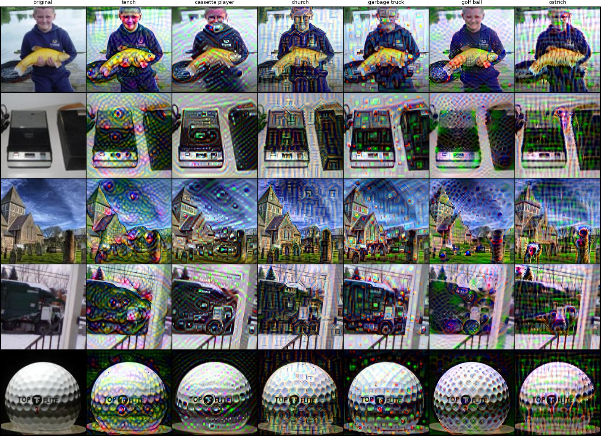

# ✨ Excitation Pullbacks: Enhancing Human Perception with AI

Excitation Pullbacks amplify the real predictive features in the data, transforming AI into a transparent tool for high-stakes decision-making. For details, check out our paper: [Pulling Back the Curtain on ReLU Networks](https://www.arxiv.org/). Please cite the paper, if you use this code.

## Setup

Create a new python environment and install packages from the `requirements.txt` file. You can use this env both as gradio environment for the interactive app and as the kernel for the jupyter notebook.

## 🤗 Demo app

Run the [gradio](https://www.gradio.app/) app locally simply by executing `python app.py` in the terminal. Alternatively, use the [public version](https://huggingface.co/spaces/) of this app hosted on Huggingface Spaces.

## Recreate experiments from the paper

Run the `pullbacks.ipynb` notebook with the appropriate kernel. 

## 📚 Technical background & attribution faithfulness

We present a novel attribution method for Deep Neural Networks, the Excitation Pullback, which is a simple modification of the vanilla gradient. Specifically, the only difference is that we perform soft gating in the backward pass only. 

The striking perceptual alignment of the produced explanations strongly suggests their faithfullness. In our paper we motivate the latter theoretically, arguing that excitation pullback directionally approximates the gradient of a kernel machine that mainly determines the network's decision. Incidentally, this gives a possible explanation for the effectiveness of Batch Normalization and Deep Features, together with a novel perspective on the network’s internal memory and generalization properties.

## ImageNet examples

To visualise the class-specific features, we perform a rudimentary 5-step pixel-space gradient ascent along the Exciation Pullbacks. We do this for 3 popular ImageNet-pretrained ReLU architectures: ResNet50, VGG11_BN and DenseNet121, this exact selection being motivated in the paper. While vanilla gradients are noisy, excitation pullbacks reveal compelling label-specific features that "just make sense". 

Specifically, in images below, each cell shows the difference between the perturbed and clean image, targeting the class in the column. Diagonal contains features of the original class, while off-diagonal contains counterfactuals. Last column is randomly selected extra label.

❗Note that excitation pullbacks tend to highlight similar features across architectures, which suggests that the models learn comparable feature representations. Additionally, the structure of the excitation pullbacks intuitively reflects the internal organization of each network, reinforcing our hypothesis that they indeed faithfully capture the underlying decision process of the model.

Excitation pullbacks for ResNet50:

Excitation pullbacks for VGG11_BN:

Excitation pullbacks for DenseNet121:

🥴 On the other hand, the vanilla gradients for all the models look like noise, e.g.

Vanilla gradients for ResNet50:

<!-- Excitation pullbacks for ResNet50:

Excitation pullbacks for VGG11_BN:

Excitation pullbacks for DenseNet121:
 -->
